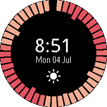

# 48h Weather Forecast Watchface

This is an incomplete port of my Pebble watchface to [rocky.js](https://developer.pebble.com/docs/rockyjs/)
Given pebble is now a [dead platform](https://blog.getpebble.com/2016/12/07/fitbit/), I'm releasing the source code.

## Description

Get a complete forecast of the next 48 hours at a single glance!

* Modern, colorful and minimalist watchface
* Displays current weather icon
* Powered by forecast.io

## How does it work

* Each bar represents an hour of the next 48 starting from the top-rightest one.
* The weather forecast ring rotates counterclockwise as time passes, displaying the next hours forecast.
* Primary bars indicate temperature (Blue - under 12ºC, Yellow - under 18ºC, Red: over 24ºC)
* Secondary bars indicate precipitation probability, the more intense the higher probability.
* Large bars represent a 12h interval split.
